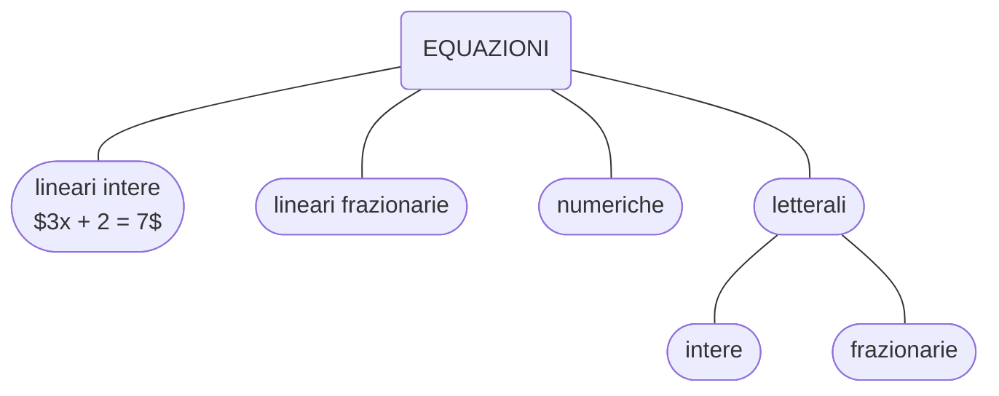

> ☆ **scadenza**: 20 novembre 2021

## obiettivi

{}

- alla fine della lezione saremo - *dovremmo essere* - in grado di risolvere le seguenti equazioni lineari:

$$\small{\left(x^{2}-2 x-2\right)^{2}-(x-2) \{(x-2)^{3}-4\left[2(x+1)-(x-1)^{2}\right] \}=11(x-1)}$$

$$\small{(3 x-1)^{3}+(3 x+1)(6 x-7)=(3 x+1)(3 x-1)^{2}}$$

$$\frac{x+3}{x-3}-\frac{2 x-1}{x^{2}-6 x+9}=\left(\frac{3}{x-3}+1\right)^{2}$$
{}

---

## 1. Le equazioni

{}
**definizione**:

Un’**equazione** è un’uguaglianza tra due espressioni che contiene una o più lettere.
{}

---

### 3. Soluzioni e dominio di un’equazione

> Sostituendo un numero al posto dell’incognita in un’equazione, essa si trasformain un’uguaglianza tra due espressioni, uguaglianza che, se ha significato, può risultare vera o falsa

{}
**definizione**: **soluzioni di un'equazione**

I numeri che, sostituiti al posto dell’incognita, trasformano un’equazione in un’uguaglianza vera si dicono **soluzioni**, o **radici**, dell’equazione data
{}

- Risolvere un’equazione significa determinare tutte le sue soluzioni.
  - L’insieme che ha per elementi tutte le soluzioni di un’equazione è l’insieme delle soluzioni e lo indicheremo sempre con $S( \text{S} \subseteq \mathbb{R})$.
  - In altre parole, risolvere un’equazione significa determinarne l’**insieme delle soluzioni**.

{}

**definizione: DOMINIO DI UN’EQUAZIONE**

Si dice **dominio** di un’equazione l’insieme dei numeri reali che, sostituiti all’incognita, trasformano l’equazione in un’uguaglianza dotata di significato e che quindi è o **vera** o **falsa.**

- Indicheremo sempre con $D$ il dominio;
- poichè le soluzioni di un’equazione devono necessariamente appartenere al dominio dell’equazione stessa, risulta:

$$S \subseteq D \subseteq \mathbb{R}$$
{}

>**ESEMPIO**:
> nella seguente equazione frazionaria:
> $$\dfrac{x -1}{x -2} + x = \dfrac{1}{2}$$
>
> - non è possibile assegnare a $x$ il valore $2$ perché si annullerebbe il denominatore della frazione al primo membro.
> - Per ogni altro valore di $x$ l’equazione si trasformerà in un’uguaglianza vera o falsa.
> - Quindi il dominio dell’equazione è: $D = \mathbb{R}-\\{2\\}$

## 4. Principi di equivalenza delle equazioni

> - **_Un mattone pesa $1$ kg più mezzo mattone. Quanto pesa un mattone?_**

### **primo** principio di equivalenza:

- *afferma che **sommando algebricamente** ad entrambi i membri di una equazione, uno **stesso numero** o una **stessa espressione contenente l'incognita**, otteniamo una equazione **equivalente** a quella data.*

### **secondo** principio di equivalenza:

---

