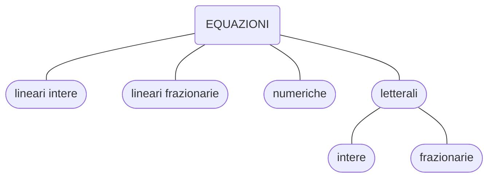

> ☆ **scadenza**: 20 novembre 2021

## obiettivi

 

{}

- alla fine della lezione saremo - *dovremmo essere* - in grado di risolvere le seguenti equazioni lineari:

$$\small{\left(x^{2}-2 x-2\right)^{2}-(x-2) \{(x-2)^{3}-4\left[2(x+1)-(x-1)^{2}\right] \}=11(x-1)}$$

$$\small{(3 x-1)^{3}+(3 x+1)(6 x-7)=(3 x+1)(3 x-1)^{2}}$$

$$\frac{x+3}{x-3}-\frac{2 x-1}{x^{2}-6 x+9}=\left(\frac{3}{x-3}+1\right)^{2}$$
{}

---

## Concetti fondamentali sulle equazioni

### 1. Le equazioni

{}
**definizione**:

Un’**equazione** è un’uguaglianza tra due espressioni che contiene una o più lettere.
{}

### 2. Classificazione delle equazioni

---

### 3. Soluzioni e dominio di un’equazione

> Sostituendo un numero al posto dell’incognita in un’equazione, essa si trasformain un’uguaglianza tra due espressioni, uguaglianza che, se ha significato, può risultare vera o falsa

{}
**definizione**: **soluzioni di un'equazione**

I numeri che, sostituiti al posto dell’incognita, trasformano un’equazione in un’uguaglianza vera si dicono **soluzioni**, o **radici**, dell’equazione data

{}
- Risolvere un’equazione significa determinare tutte le sue soluzioni.
  
  - L’insieme che ha per elementi tutte le soluzioni di un’equazione è l’insieme delle soluzioni e lo indicheremo sempre con $$S= ( \text{S} \subseteq \mathbb{R})$$.
  - In altre parole, risolvere un’equazione significa determinarne l’**insieme delle soluzioni**.
{}

**definizione: DOMINIO DI UN’EQUAZIONE**

Si dice **dominio** di un’equazione l’insieme dei numeri reali che, sostituiti all’incognita, trasformano l’equazione in un’uguaglianza dotata di significato e che quindi è o **vera** o **falsa.**

- Indicheremo sempre con $D$ il dominio;
- poichè le soluzioni di un’equazione devono necessariamente appartenere al dominio dell’equazione stessa, risulta:

$$S \subseteq D \subseteq \mathbb{R}$$
{}

 

>**ESEMPIO**:
> nella seguente equazione frazionaria:
> $$\dfrac{x -1}{x -2} + x = \dfrac{1}{2}$$
>
> - non è possibile assegnare a $x$ il valore $2$ perché si annullerebbe il denominatore della frazione al primo membro.
> - Per ogni altro valore di $x$ l’equazione si trasformerà in un’uguaglianza vera o falsa.
> - Quindi il dominio dell’equazione è: $$D = \mathbb{R}-\\{2\\}$$

### Equazioni **determinate**, **impossibili**, **indeterminate.**

- Nella risoluzione di un’equazione si possono presentare i seguenti casi.
  - L’insieme delle soluzioni contiene un numero finito di elementi, cioè l’**equazione ha un numero finito di soluzioni**: diremo allora che l’equazione è **determinata.**
    - L’equazione $x^2=4$ è **determinata**, perché i numeri il cui quadrato è $4$ sono $2$ e $-2$ e quindi le soluzioni sono $2$ e $-2$:
    $$S= \\{ -2; \\, 2\\}$$
  - L’insieme delle soluzioni è vuoto $S= \\{\emptyset \\}$, cioè l’equazione **non ha soluzioni**: diremo allora che l’equazione è **impossibile.**
    - L'equazione $x=x+5$ è **impossibile** $\Rightarrow S = \emptyset$
  - L’insieme delle soluzioni contiene un numero infinito di elementi, cioè l’equazione ha **infinite soluzioni**: diremo allora che l’equazione è **indeterminata.**
    - L'equazione: $$(x + 1)^2 = x^2 + 2x + 1$$ è verificata $\forall x \in \mathbb{R}$ e quindi è **indeterminata**: $S = \mathbb{R}$.
    - L'equazione è una **identità** perché è sempre verificata nel suo dominio $D$

 

---

### 5. Equazioni equivalenti

 
{}

**definizione: EQUAZIONI EQUIVALENTI**

Due equazioni si dicono **equivalenti** se hanno lo stesso **insieme delle soluzioni**.
{}

---

<!--  -->

 

### 6. Principi di equivalenza delle equazioni

### $\star$ **primo** principio di equivalenza:

- *afferma che **sommando algebricamente** ad entrambi i membri di una equazione, uno **stesso numero** o una **stessa espressione contenente l'incognita**, otteniamo una equazione **equivalente** a quella data.*

### $\star \star$ **secondo** principio di equivalenza:

- *moltiplicando o dividendo entrambi i membri di una uguaglianza per uno **stesso numero***diverso da zero*, o per una **stessa espressione algebrica**, sempre definita e sempre diversa da zero nel dominio D dell'equazione, si ottiene un'equazione **equivalente** a quella data.*

 

> **ESEMPIO:**
>
> - _Un mattone pesa $1$ kg più mezzo mattone. Quanto pesa un mattone?_
>
> Il calcolo letterale e le equazioni ci permettono di sviluppare dei *procedimenti* in modo simbolico e di pervenire rapidamente alla soluzione.
>
> - Nel nostro caso, indicando con $x$ il peso di un mattone (espresso in kg), la situazione può essere espressa in forma simbolica dall’equazione:
>
> $$x = 1 + \dfrac{1}{2} x$$
>
> - utilizzando in modo opportuno i due *principi di equivalenza* possiamo semplificare l'equazione:
> $$x \textcolor{red}{- \dfrac{1}{2}x} = 1 + \cancel{\dfrac{1}{2} x} \textcolor{red}{- \cancel{\dfrac{1}{2}x}} \rightarrow x-\dfrac{1}{2} x=1 \quad \longrightarrow \quad \dfrac{1}{2} x=1$$
> $$\textcolor{red}{2 \\; \cdot} \dfrac{1}{2} x = \textcolor{red}{2 \\; \cdot} 1$$
> - semplificando otteniamo la soluzione:
> $$\textcolor{darkorange}{x=2}$$

---

### 7. Conseguenze dei principi di equivalenza

 

- **Regola del trasporto:** Se entrambi i membri di un'equazione sono polinomi, si può *trasportare* un termine da un membro all'altro, cambiandogli il segno;

- Se entrambi i membri di un’equazione sono polinomi e uno stesso termine compare in entrambi i membri, si può eliminare tale termine da entrambi i membri dell’equazione;

- Se entrambi i membri di un’equazione sono polinomi e i coefficienti dei loro termini sono tutti multipli di uno stesso numero, si possono dividere tutti i coefficienti per tale numero;

- Se in un’equazione intera compaiono frazioni o termini con coefficienti frazionari, è possibile ridurre entrambi i membri allo stesso denominatore e poi eliminare il denominatore comune;

- Si può cambiare il segno di entrambi i membri di un’equazione.
  - Infatti cio`equivale amoltiplicare per1 entrambi i membri dell’equazione.
  - In particolare, se entrambi i membri sono polinomi, si può cambiare il segno di tutti i termini di entrambi i membri.

---

### 8. Grado di un'equazione intera

Consideriamo un’equazione nell’incognita $x$ i cui membri siano espressioni intere, cioè polinomi.
E`sempre possibile, applicando le regole che sono conseguenze dei principi di equivalenza, scriverla nella forma:
$$P(x) = 0$$

dove il primo membro, che abbiamo indicato con $P(x) = 0$, è un polinomio nella variabile $x$ e il secondo membro è zero.

> Tale forma è anche detta **forma canonica** o **forma normale** dell’equazione.

{}

**definizione: Grado di un'equazione intera**

Data un’equazione nell’incognita $x$, scritta nella forma canonica $P(x) = 0$, si dice grado dell’equazione il grado del polinomio $P(x)$ rispetto alla lettera $x$.
{}

- Le equazioni di primo grado sono anche dette equazioni **lineari**.
- La forma canonica di un’equazione lineare nell’incognita $x$ è: $$mx + q = 0$$
  - dove $m$ e $q$ sono numeri reali, con $m \neq 0$

### 9. Procedimento risolutivo delle equazioni intere

$$\small{(3 x-1)^{3}+(3 x+1)(6 x-7)=(3 x+1)(3 x-1)^{2}}$$

### 10. Procedimento risolutivo delle equazioni frazionarie

#### Condizioni di accettabilità

- Poiché le soluzioni di un’equazione devono appartenere al suo dominio, in alternativa al dominio si possono indicare le condizioni a cui devono soddisfare le eventuali soluzioni.
Tali condizioni sono dettecondizioni di accettabilità. Useremo la notazione **C.A.** per indicare le **Condizioni di Accettabilità** delle soluzioni di un’equazione.

- Nel caso di equazioni frazionarie, le condizioni di accettabilità mettono in evidenza che la soluzione non può coincidere con i valori che annullano qualche denominatore al primo o al secondo membro.

#### Le fasi del procedimento risolutivo

Enunciamo ora il procedimento  per  risolvere  un’equazione  numerica  frazionaria.

1. Se è possibile, si scompongono in fattori i denominatori che figurano nell’equazione.
2. Si formulano le condizioni di accettabilità (oppure si esplicita il *dominio* dell’equazione).
3. Si riducono entrambi i membri dell’equazione allo stesso denominatore.
4. Si eliminano i denominatori, moltiplicando entrambi i membri per il denominatore comune.
5. Si risolve l’equazione intera così ottenuta.
6. Delle soluzioni ottenute si accettano solo quelle che soddisfano le condizionidi accettabilità (cioè solo quelle che appartengono al dominio).

- I passaggi indicati nei punti **5.** e **6.** sono giustificati dal secondo principio di equivalenza.

{}

- **esempio 1**

$$\frac{x+2}{x-1}-\frac{x}{x+2}=\frac{3 x}{x^2+x-2}$$

- **esempio 2**

$$\frac{x+3}{x-3}-\frac{2 x-1}{x^{2}-6 x+9}=\left(\frac{3}{x-3}+1\right)^{2}$$

{}

 