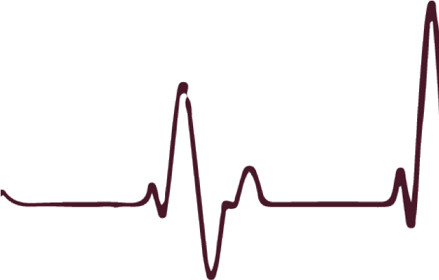
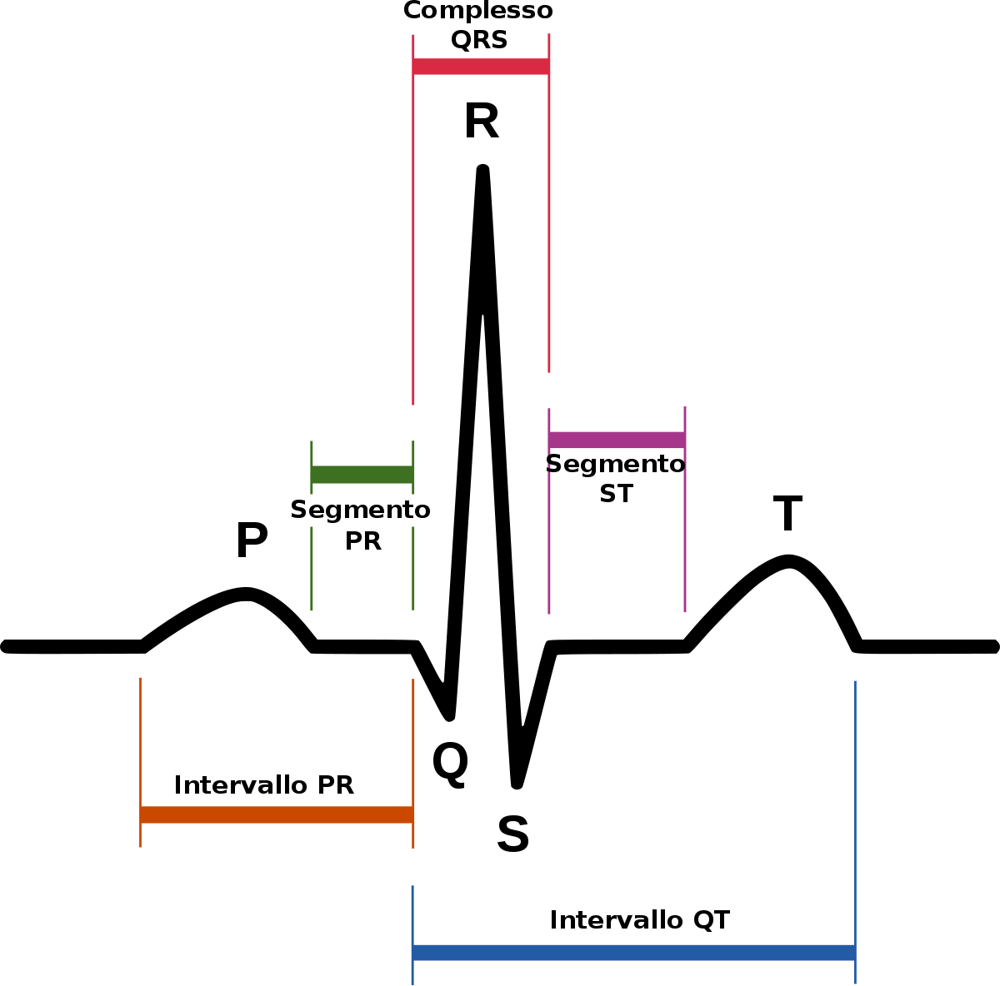



<section data-transition="convex">

<h2 style="color:#3B2F2F" class="r-fit-text">RELAZIONI</h2>

<h2 style="color:#8A4117" class="r-fit-text">FUNZIONI</h2>

---

</section>



## Relazioni e Funzioni

### - *Rif.: Capitolo 4* -

*prof. **diego fantinelli***

*ITI "Enrico Fermi" - Bassano del Grappa * 
*matematica per il biennio*

---

<section data-transition="convex">

## prerequisiti

- **Fattorizzazione polinomiale**

  - indispensabile per poter semplificare una *frazione algebrica*

- **mcm** tra polinomi

  - per potersi riportare alla **forma normale** di una *frazione algebrica*: $\frac{N(x)}{D(x)}$

</section>

<section data-transition="convex">

<h2 style="color:#8A4117">Relazioni $\mathcal{R}$</h2>

{}

<h3 style="color:#8A4117">definizione:</h3>

- Si dice **Codominio** ogni frazione che ha per denominatore una potenza di $10$ con **esponente positivo**.

$$\dfrac{\text{numeratore}}{\text{denominatore}} \rightarrow \dfrac{N(x)}{D(x)} \rightarrow \dfrac{x+1}{x^2 -1}$$

{}

<h5 style="color:#8A4117" class="fragment"> - Il <b>dividendo</b> prende il nome di numeratore</h5>
<h5 class="fragment" style="color:#8A4117"> - Il <b>divisore</b> prende il nome di denominatore</h5>

---



## La funzione Happiness

$\textbf{Happiness(t)}=w_{0}+w_{1} \cdot\displaystyle{\sum_{j=1}^{t}} \gamma^{t-j} C R_{j}+w_{2} \cdot\sum_{j=1}^{t} \gamma^{t-j} E V_{j}+w_{3} \cdot\sum_{j=1}^{t} \gamma^{t-j} R P E_{j}$

<ul style="font-size:80%;">
  <li>$t$; $w_0$, $w_1$, $w_2$ e $w_3$ sono costanti che indicano l’influenza dei diversi tipi di eventi;</li>
  <li>$\gamma$ è un “forgetting factor” (fattore dimenticando) che rende gli eventi degli studi più recenti più influenti rispetto a quelli precedenti;</li>
  <li>$CRj$ è la gratificazione ottenuta dalla scelta su un processo $j$;</li>
  <li>$EVj$ è la valutazione del rischio su di un processo $j$;</li>
  <li>$RPEj$ rappresenta la differenza tra la ricompensa desiderata e quella effettivamente ottenuta dal processo $j$.</li>
</ul>

</section>

<section data-background-image="real_life_bkg.jpg" data-background-opacity="0.5" data-transition="convex">

<h2 style="color:#3B2F2F" class="r-fit-text">esempi di funzione</h2>

<h2 style="color:#3B2F2F" class="r-fit-text">nella vita reale</h2>

</section>

<section>

<table>
  <tr>
    <td><h3>Competenza</h3></td>
    <td>Descrizione</td>
  </tr>
  <tr>
    <td>$CRj$ è la gratificazione ottenuta dalla scelta su un processo $j$;</td>
    <td>$CRj$ è la gratificazione ottenuta dalla scelta su un processo $j$;</td>
  </tr>
</table>

</section>

<section>

<h2>Tabella Competenze</h2>

la gratificazione ottenuta dalla scelta su un processo $j$

la gratificazione ottenuta dalla scelta su un processo $j$

la gratificazione ottenuta dalla scelta su un processo $j$

la gratificazione ottenuta dalla scelta su un processo $j$

</section>

<section data-transition="convex">

## L'ECG - elettrocardiogramma

Per evitare di commettere gravi errori devi ricordare che, in una frazione algebrica, puoi semplificare solo i fattori comuni al numeratore e al denominatore

</section>

---

<section data-background-video="ooo.mp4" data-background-opacity="0.7" data-transition="convex">

## Destinatari: la classe

- Sono del tipo:

$$P(x) = 0$$

- con $P(x)$ un Polinomio in $x$ di grado $n$

### $$x^2 + 5x + 6 = 0$$

</section>

---

<section data-transition="zoom">



<h2 style="color:#8A4117" class="r-fit-text">DOMANDE?</h2>

<h2 style="color:#8A4117" class="fragment">Buon lavoro!</h2>

</section>

---

