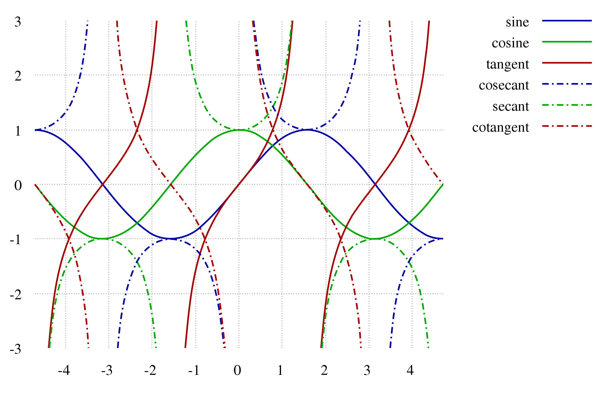



<section data-transition="convex">
  <h2 style="color:#3B2F2F" class="r-fit-text">Relazioni e Funzioni</h2>
  <h3 class="fragment" style="color:#3B2F2F"><em>- Rif.: Capitolo 4 -</em></h3>
  
  <h4 style="color:#8A4117"><em>prof. diego fantinelli</em></h4>
  
ITI "Enrico Fermi" - Bassano del Grappa

  
<em>matematica per il biennio &mdash; classi prime</em>

</section>

---
<!-- prerequisiti-->


<section style="font-size:90%" data-transition="convex">
  <h2 style="color:#3B2F2F">Prerequisiti</h2>

  <ul class="fragment">
  <li class="fragment"><h3 style="color:#8A4117">insiemi numerici:</h3></li>
    <ul class="fragment">
      <li>Operazioni e nomenclatura insiemistiche</li>
      <li>Operazioni in $\mathbb{N}, \mathbb{Z}, \mathbb{Q}, \mathbb{R}$</li>
    </ul>
  

  <li class="fragment"><h3 style="color:#8A4117">teoria degli insiemi</h3></li>
    <ul class="fragment">
      <li>Rappresentazioni: estensiva, intensiva e Diagrammi di Eulero-Venn</li>
      <li>Prodotto Cartesiano: definizione e rappresentazione</li>
    </ul>
</section>

---



<section data-background-video="teaching.mp4" data-background-opacity="0.5" data-transition="zoom">
  <h2 style="color:#3B2F2F;" class="r-fit-text">Relazioni e</h2>
  <h2 style="color:#3B2F2F;" class="r-fit-text">FUNZIONI</h2>
</section>

<section>
<h3 class="fragment" style="color:#3B2F2F; font-size: 40px;"><em>In fisica e in matematica è impressionante la sproporzione tra lo sforzo per capire una cosa nuova per la prima volta e la semplicità e naturalezza del risultato una volta che i vari passaggi sono stati compiuti.
 Nel prodotto finito, nelle scienze come in poesia, non c'è traccia della fatica del processo creativo e dei dubbi e delle esitazioni che lo accompagnano. 
 &mdash; Giorgio Parisi</em></h3>
</section>

<section>
<h2 style="color:#3B2F2F">Relazione $\mathscr{R}$</h2>
<h3 class="fragment" style="text-align:left; color:#3B2F2F;">definizione:</h3>

<q class="fragment" style="color:#C04000; font-size:90%; background-color:#F3E5AB;">Dati due insiemi non vuoti $A$ e $B$, si dice **relazione** tra $A$ e $B$ - e si indica con $\mathscr{R}$ -, una **legge** che associa elementi dell’insieme $A$ con elementi dell’insieme $B$.</q>
<ul>
  <li class="fragment">Se una relazione opera tra un insieme $A$ e se stesso, si dice relazione nell’insieme $A$.</li>
  <li class="fragment">In generale si scrive: $\mathscr{R}: A \longrightarrow B$ </li>
  <li class="fragment">oppure: $\mathscr{R}: a \in A \longrightarrow b \in B$</li>
</ul>
</section>

<section data-background-video="archery.mp4" data-background-opacity="0.8" data-transition="convex">
  <h2 class="r-fit-text" style="color:#FFF0F5">Definizioni</h2>
</section>

<section>
  <h2 class="fragment" style="color:#3B2F2F" class="r-fit-text">Dominio e Codominio</h2>
</section>

<section>
  <h2 class="fragment" style="color:#3B2F2F" class="r-fit-text">Immagine e Controimmagine</h2>
</section>

<section>
<h2 style="color:#8A4117" class="r-fit-text">proprietà delle relazioni:</h2>
<ul class="fragment">
  <li><h3>Simmetrica e antisimmetrica</h3></li>
    <ul>
      <li>una relazione si dice simmetrica</li>
      <li>una relazione si dice simmetrica</li>
    </ul>
  <li><h3>Riflessiva e antiriflessiva</h3></li>
    <ul>
      <li>una relazione si dice simmetrica</li>
      <li>una relazione si dice simmetrica</li>
    </ul>
</ul>
</section>

<section>
<h2 style="color:#8A4117">Relazioni di equivalenza</h2>
<h4 class="fragment" style="text-align:left; color:#8A4117;">definizione:</h4>
<q class="fragment" style="color:#C04000; font-size:90%; background-color:#F3E5AB;">Dati due insiemi non vuoti $A$ e $B$, si dice **relazione** tra $A$ e $B$ - e si indica con $\mathcal{R}$ -, una **legge** che associa elementi dell’insieme $A$ con elementi dell’insieme $B$.</q>
</section>

<section>
<h2 style="color:#8A4117">Relazioni di ordine</h2>
<h4 class="fragment" style="text-align:left; color:#8A4117;">definizione:</h4>
<q class="fragment" style="color:#C04000; font-size:90%; background-color:#F3E5AB;">Dati due insiemi non vuoti $A$ e $B$, si dice **relazione** tra $A$ e $B$ - e si indica con $\mathcal{R}$ -, una **legge** che associa elementi dell’insieme $A$ con elementi dell’insieme $B$.</q>
</section>

---



<section data-transition="convex">
<h2 style="color:#3B2F2F; font-size:120pt">Funzioni</h2>
<h3 class="fragment" style="text-align:left; color:#3B2F2F;">definizione: $f: X \longrightarrow Y$</h3>

<q class="fragment" style="color:#C04000; font-size:90%; background-color:#F3E5AB;">Dati due insiemi non vuoti $X$ e $Y$, si dice **funzione** tra $X$ e $Y$, una **legge** che associa **ad ogni** elemento $x$ dell’insieme $X$
**uno e uno solo** elemento $y$ dell’insieme $Y$
<ul>
  <li class="fragment">si scrive: oppure $f: x \in X \longrightarrow y \in Y$</li>
  <li class="fragment">oppure, nella forma più compatta: $y=f(x)$</li>
</ul>
</q>
</section>

<section data-transition="convex">
  <h2>The Lorenz Equations</h2>
    \[\begin{aligned}
    \dot{x} &amp; = \sigma(y-x) \\
    \dot{y} &amp; = \rho x - y - xz \\
    \dot{z} &amp; = -\beta z + xy
    \end{aligned}\]
</section>

<section data-transition="convex">
  <h2 style="color:#3B2F2F" class="r-fit-text">definizioni importanti</h2>
  
<em><b>Dominio:</b> In una funzione il <b>dominio</b> coincide - a meno di punti particolari - con l'insieme di partenza;</em>

  
<em><b>Co-Dominio:</b> In una funzione il <b>dominio</b> coincide - a meno di punti particolari - con l'insieme di partenza;</em>

  
<em><b>Immagine:</b> In una funzione il <b>dominio</b> coincide - a meno di punti particolari - con l'insieme di partenza;</em>

  
<em><b>Contro-Immagine:</b> In una funzione il <b>dominio</b> coincide - a meno di punti particolari - con l'insieme di partenza;</em>

</section>

---



<section>
  <h2 style="color:#3B2F2F" class="r-fit-text">Proprietà delle   funzioni</h2>
</section>

<section>
<h2 style="color:#8A4117">Funzioni INIETTIVE</h2>
<h4 class="fragment" style="text-align:left; color:#8A4117;">definizione:</h4>
<q class="fragment" style="color:#C04000; font-size:90%; background-color:#F3E5AB;">Dati due insiemi non vuoti $A$ e $B$, si dice **relazione** tra $A$ e $B$ - e si indica con $\mathcal{R}$ -, una **legge** che associa elementi dell’insieme $A$ con elementi dell’insieme $B$.</q>
</section>

<section>
<h2 style="color:#8A4117">Funzioni SURIETTIVE</h2>
<h4 class="fragment" style="text-align:left; color:#8A4117;">definizione:</h4>
<q class="fragment" style="color:#C04000; font-size:90%; background-color:#F3E5AB;">Dati due insiemi non vuoti $A$ e $B$, si dice **relazione** tra $A$ e $B$ - e si indica con $\mathcal{R}$ -, una **legge** che associa elementi dell’insieme $A$ con elementi dell’insieme $B$.</q>
</section>

<section>
<h2 style="color:#8A4117">Funzioni BIUNIVOCHE</h2>
<h4 class="fragment" style="text-align:left; color:#8A4117;">definizione:</h4>
<q class="fragment" style="color:#C04000; font-size:90%; background-color:#F3E5AB;">Dati due insiemi non vuoti $A$ e $B$, si dice **relazione** tra $A$ e $B$ - e si indica con $\mathcal{R}$ -, una **legge** che associa elementi dell’insieme $A$ con elementi dell’insieme $B$.</q>
</section>

<section>
<h2 style="color:#8A4117">Funzioni invertibili</h2>
<h4 class="fragment" style="text-align:left; color:#8A4117;">definizione:</h4>
<q class="fragment" style="color:#C04000; font-size:90%; background-color:#F3E5AB;">Dati due insiemi non vuoti $A$ e $B$, si dice **relazione** tra $A$ e $B$ - e si indica con $\mathcal{R}$ -, una **legge** che associa elementi dell’insieme $A$ con elementi dell’insieme $B$.</q>
</section>

<section>
<h2 style="color:#8A4117">Funzione inversa</h2>
<h4 class="fragment" style="text-align:left; color:#8A4117;">definizione:</h4>
<q class="fragment" style="color:#C04000; font-size:90%; background-color:#F3E5AB;">Dati due insiemi non vuoti $A$ e $B$, si dice **relazione** tra $A$ e $B$ - e si indica con $\mathcal{R}$ -, una **legge** che associa elementi dell’insieme $A$ con elementi dell’insieme $B$.</q>
</section>

<section>
<h2 style="color:#3B2F2F" class="r-fit-text">osservazioni</h2>

<ul style="font-size:80%;">
  <li>In una funzione il **dominio** coincide - a meno di punti particolari - con l'insieme di partenza;</li>
  <li>$\gamma$ è un “forgetting factor” (fattore dimenticando) che rende gli eventi degli studi più recenti più influenti rispetto a quelli precedenti;</li>
  <li>$CRj$ è la gratificazione ottenuta dalla scelta su un processo $j$;</li>
  <li>$EVj$ è la valutazione del rischio su di un processo $j$;</li>
</ul>
</section>

---

<section>
  <h2 style="color:#3B2F2F" class="r-fit-text">Funzioni   notevoli</h2>
</section>

---

<section data-background-image="real_life_bkg.jpg" data-background-opacity="0.5" data-transition="zoom">
  <h2 style="color:#3B2F2F" class="r-fit-text">esempi di funzione</h2>
  <h2 style="color:#3B2F2F" class="r-fit-text">nella vita reale</h2>
</section>

<section>
  <h2 style="color:#3B2F2F" class="r-fit-text">esempi di funzione</h2>
  
</section>

<section data-background-image="heart_01.gif" data-background-opacity="0.4" data-transition="convex">
  <h2 style="background-color:powderblue;">l'elettrocardiogramma</h2>
  <q style="background-color:#F3E5AB;">Per evitare di commettere gravi errori devi ricordare che, in una frazione algebrica, puoi semplificare solo i fattori comuni al numeratore e al denominatore
  </q>

</section>

<section data-background-image="heart_01.gif" data-background-opacity="0.4" data-transition="convex">
  <ul class="r-fit-text">
    <li><em>Onda P</em>: piccola onda positiva, indica la depolarizzazione atriale (attivazione elettrica degli atri)</li>
    <li><em>Intervallo PR</em>: distanza fra l’inizio dell’onda P e l’inizio del complesso QRS, rappresenta l’intervallo necessario perché la depolarizzazione atriale raggiunga i ventricoli</li>
    <li><em>Complesso QRS</em>: rappresenta la depolarizzazione ventricolare</li>  
    <li><em>Onda Q</em>: prima deflessione negativa</li>
    <li><em>Onda R</em>: prima deflessione positiva</li>
    <li><em>Onda S</em>: seconda deflessione negativa</li>
    <li><em>Tratto ST</em>: distanza fra l’onda S e l’inizio dell’onda T, rappresenta l’intervallo fra la depolarizzazione ventricolare e l’inizio della ripolarizzazione ventricolare (ripristino delle condizioni elettriche di base)</li>
    <li>**Onda T**: prima onda positiva successiva al complesso QRS, rappresenta la ripolarizzazione ventricolare</li>
    <li>**Intervallo QT**: distanza fra l’inizio del QRS e la fine dell’onda T, rappresenta l’intera attività elettrica ventricolare</li>
    <li>**Onda U**: onda positiva successiva all’onda T, non sempre presente, rappresenta la ripolarizzazione delle fibre del Purkinje</li>
  </ul>
</section>

---



<h3>La funzione Happiness</h3>

$\textbf{Happiness(t)}=w_{0}+w_{1} \cdot\displaystyle{\sum_{j=1}^{t}} \gamma^{t-j} C R_{j}+w_{2} \cdot\sum_{j=1}^{t} \gamma^{t-j} E V_{j}+w_{3} \cdot\sum_{j=1}^{t} \gamma^{t-j} R P E_{j}$

<ul style="font-size:80%;">
  <li>$t$; $w_0$, $w_1$, $w_2$ e $w_3$ sono costanti che indicano l’influenza dei diversi tipi di eventi;</li>
  <li>$\gamma$ è un “forgetting factor” (fattore dimenticando) che rende gli eventi degli studi più recenti più influenti rispetto a quelli precedenti;</li>
  <li>$CRj$ è la gratificazione ottenuta dalla scelta su un processo $j$;</li>
  <li>$EVj$ è la valutazione del rischio su di un processo $j$;</li>
  <li>$RPEj$ rappresenta la differenza tra la ricompensa desiderata e quella effettivamente ottenuta dal processo $j$.</li>
</ul>

---



<section>
  <h2 style="color:#ffffff" class="r-fit-text">DOMANDE?</h2>
</section>

---

<section data-background-color="#EDEDED">

</section>