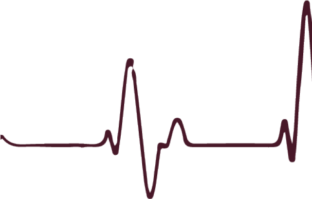
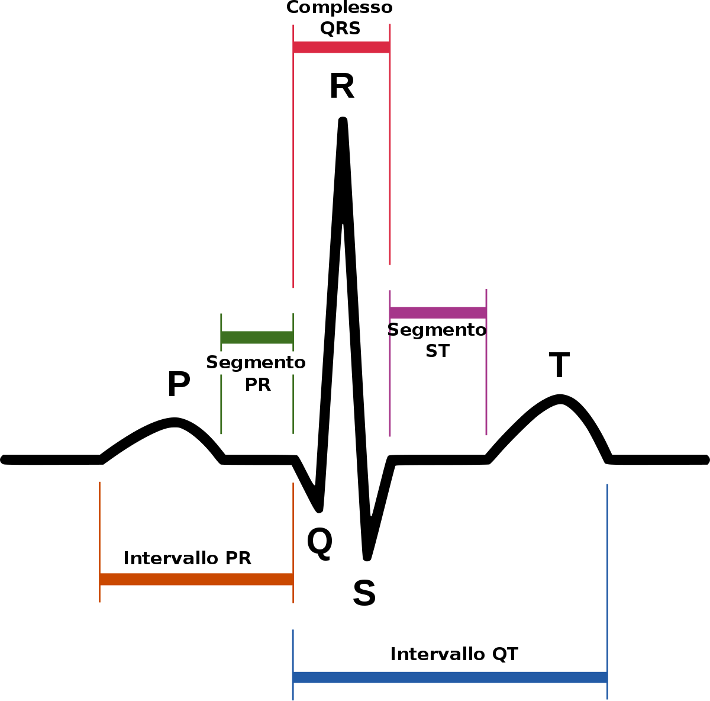



<section data-transition="convex">
  
  <h2 style="color:#3B2F2F" class="r-fit-text">CONCORSO 2022</h2>
  <h2 style="color:#8A4117" class="r-fit-text">STEM A26</h2>
</section>

<section data-transition="convex">
  <h2 style="color:#3B2F2F">Lezione simulata</h2>
  <h3 class="fragment" style="color:#3B2F2F"><em>La traccia nel dettaglio</em></h3>
   
   
   
  <h4 style="color:#483C32">candidato:<em> diego fantinelli</em></h3>
</section>

---

<section data-background-video="ooo.mp4" data-background-opacity="0.7" data-transition="convex">
  <h2 style="color:#3B2F2F" class="r-fit-text">Destinatari:</h2>
  <h2 style="color:#3B2F2F">La classe</h2>
   
  <table class="fragment fade-in">
    <tr>
      <td><b>cosa</b></td>
      <td><b>descrizione</b></td>
    </tr>
    <tr>
      <td><b>conoscenze</b></td>
      <td style="font-size:90%"><i>$CRj$ è la gratificazione ottenuta dalla scelta su un processo $j$;<i></td>
    </tr>
    <tr>
      <td><b>abilità</b></td>
      <td style="font-size:90%"><i>$CRj$ è la gratificazione ottenuta dalla scelta su un processo $j$;<i></td>
    </tr>
    <tr>
      <td><b>competenze</b></td>
      <td style="font-size:90%"><i>$CRj$ è la gratificazione ottenuta dalla scelta su un processo $j$;<i></td>
    </tr>
  </table>
</section>

<section>
  <h2 class="r-fit-text">Idee chiave presenti nelle Linee guida</h2>
  <h3 class="r-fit-text">Linee guida per gli istituti tecnici (2010):</h3>

  <ul class="r-fit-text">
    <li>individuare collegamenti tra matematica e altre discipline e tra matematica e realtà <em>(modello matematico)</em></li> 
    <li>individuare collegamenti all’interno della matematica</li>
    <li>sviluppare l’algebra interpretandola graficamente</li>
    <li>utilizzare diversi registri rappresentativi</li>
    <li>inquadrare storicamente l’evoluzione della disciplina</li>
    <li>utilizzare strumenti informatici di rappresentazione geometrica e di calcolo</li>
  </ul>
</section>

<section data-auto-animate>

<h2>Competenze</h2>

<ul style="font-size:90%;">
  <li class="fragment fade-in-then-semi-out">la gratificazione ottenuta dalla scelta su un processo $j$</li>
  <li class="fragment fade-in-then-semi-out">la gratificazione ottenuta dalla scelta su un processo $j$</li>
  <li class="fragment fade-in-then-semi-out">la gratificazione ottenuta dalla scelta su un processo $j$</li>
  <li class="fragment fade-in-then-semi-out">la gratificazione ottenuta dalla scelta su un processo $j$</li>
</ul>
</section>

<section data-auto-animate>
<h2>Tabella Competenze</h2>
<ul style="font-size:90%">
  <li style="color:#C04000" font-size:90%>la gratificazione ottenuta dalla scelta su un processo $j$</li>
  <li>la gratificazione ottenuta dalla scelta su un processo $j$</li>
  <li style="color:#C04000">la gratificazione ottenuta dalla scelta su un processo $j$</li>
  <li>la gratificazione ottenuta dalla scelta su un processo $j$</li>
</ul>
</section>

---

<section data-background-image="white_sky.jpeg" data-background-opacity="0.5" data-transition="zoom">
  <h2 style="color:#3B2F2F">La lezione</h2>
  <h2 style="color:#3B2F2F;" class="r-fit-text; fragment">Relazioni e FUNZIONI</h2>
  
</section>

<section data-background-image="white_sky.jpeg" data-background-opacity="0.4" data-transition="zoom">
<h3 class="fragment" style="color:#3B2F2F; font-size: 40px;"><em>In fisica e in matematica è impressionante la sproporzione tra lo sforzo per capire una cosa nuova per la prima volta e la semplicità e naturalezza del risultato una volta che i vari passaggi sono stati compiuti.
 Nel prodotto finito, nelle scienze come in poesia, non c'è traccia della fatica del processo creativo e dei dubbi e delle esitazioni che lo accompagnano. 
 &mdash; Giorgio Parisi</em></h3>
</section>

<section data-background-image="white_sky.jpeg" data-background-opacity="0.4" data-transition="convex">
<h2 style="color:#3B2F2F" class="r-fit-text">Relazione $\mathscr{R}$</h2>
<h3 class="fragment" style="text-align:left; color:#3B2F2F;">definizione:</h3>

<q class="fragment" style="color:#C04000; font-size:90%; background-color:#F3E5AB;">Dati due insiemi non vuoti $A$ e $B$, si dice **relazione** tra $A$ e $B$ - e si indica con $\mathcal{R}$ -, una **legge** che associa elementi dell’insieme $A$ con elementi dell’insieme $B$.
<ul class="fragment">
  <li>Se una relazione opera tra un insieme $A$ e se stesso, si dice relazione nell’insieme $A$.</li>
</ul>
</q>

In generale si scrive: $\mathcal{R}: A \longrightarrow B$ 
oppure: $\mathcal{R}: a \in A \longrightarrow b \in B$

</section>

<section data-background-image="real_life_bkg.jpg" data-background-opacity="0.4" data-transition="convex">
<h2 style="color:#8A4117" class="r-fit-text">proprietà delle relazioni:</h2>
<ul class="fragment">
  <li><h3>Simmetrica e antisimmetrica</h3></li>
    <ul>
      <li>una relazione si dice simmetrica</li>
      <li>una relazione si dice simmetrica</li>
    </ul>
  <li><h3>Riflessiva e antiriflessiva</h3></li>
    <ul>
      <li>una relazione si dice simmetrica</li>
      <li>una relazione si dice simmetrica</li>
    </ul>
</ul>
</section>

<section data-background-image="real_life_bkg.jpg" data-background-opacity="0.4" data-transition="convex">
<h2 style="color:#8A4117">Relazioni di equivalenza</h2>
<h4 class="fragment" style="text-align:left; color:#8A4117;">definizione:</h4>
<q class="fragment" style="color:#C04000; font-size:90%; background-color:#F3E5AB;">Dati due insiemi non vuoti $A$ e $B$, si dice **relazione** tra $A$ e $B$ - e si indica con $\mathcal{R}$ -, una **legge** che associa elementi dell’insieme $A$ con elementi dell’insieme $B$.</q>
</section>

<section data-background-image="real_life_bkg.jpg" data-background-opacity="0.4" data-transition="convex">
<h2 style="color:#8A4117">Relazioni di ordine</h2>
<h4 class="fragment" style="text-align:left; color:#8A4117;">definizione:</h4>
<q class="fragment" style="color:#C04000; font-size:90%; background-color:#F3E5AB;">Dati due insiemi non vuoti $A$ e $B$, si dice **relazione** tra $A$ e $B$ - e si indica con $\mathcal{R}$ -, una **legge** che associa elementi dell’insieme $A$ con elementi dell’insieme $B$.</q>
</section>

---

<section data-background-image="gear_00.png" data-background-opacity="0.4" data-transition="convex">
<h2 style="color:#8A4117" class="r-fit-text">Funzioni</h2>
<h3 class="fragment" style="text-align:left; color:#8A4117;">definizione:</h3>

<q class="fragment" style="color:#C04000; background-color:#F3E5AB;">Dati due insiemi non vuoti $X$ e $Y$, si dice **funzione** tra $X$ e $Y$, una **legge** che associa **ad ogni** elemento $x$ dell’insieme $X$
**uno e uno solo** elemento $y$ dell’insieme $Y$</q>

si scrive:
$f: X \longrightarrow Y$ oppure $f: x \in X \longrightarrow y \in Y$

<q class="fragment" style="color:#C04000;">Si legge: $f$ è una funzione che associa un elemento $x$ appartenente ad $X$ ad un elemento $y$ appartenente a $Y$.</q>

oppure, nella forma più compatta: $y=f(x)$
 
</section>

<section data-background-iframe="https://mathbrain.netlify.app"
          data-background-interactive>
  <h2>Iframe</h2>
</section>

<section>
  <h2>The Lorenz Equations</h2>
    \[\begin{aligned}
    \dot{x} &amp; = \sigma(y-x) \\
    \dot{y} &amp; = \rho x - y - xz \\
    \dot{z} &amp; = -\beta z + xy
    \end{aligned}\]
</section>

<section>
<h2 style="color:#3B2F2F" class="r-fit-text">definizioni importanti</h2>

<table style="font-size:85%">
  <tr style="background-color:#F3E5AB;">
    <td><em>Dominio</em></td>
    <td>Descr$CRj$ è la gratificazione ottenuta dalla scelta su un processo $j$;izione</td>
  </tr>
  <tr style="background-color:#F3E5AB;">
    <td><em>Codominio</em></td>
    <td>$CRj$ è la gratificazione ottenuta dalla scelta su un processo $j$;</td>
  </tr>
  <tr style="background-color:#FFF0F5;">
    <td><em>Immagine</em></td>
    <td>$CRj$ è la gratificazione ottenuta dalla scelta su un processo $j$;</td>
  </tr>
  <tr style="background-color:#FFF0F5;">
    <td><em>Controimmagine</em></td>
    <td>$CRj$ è la gratificazione ottenuta dalla scelta su un processo $j$;</td>
  </tr>
</table>
</section>

<section>
<h2 style="color:#3B2F2F" class="r-fit-text">osservazioni</h2>

$\textbf{Happiness(t)}=w_{0}+w_{1} \cdot\displaystyle{\sum_{j=1}^{t}} \gamma^{t-j} C R_{j}+w_{2} \cdot\sum_{j=1}^{t} \gamma^{t-j} E V_{j}+w_{3} \cdot\sum_{j=1}^{t} \gamma^{t-j} R P E_{j}$

<ul style="font-size:80%;">
  <li>In una funzione il **dominio** coincide - a meno di punti particolari - con l'insieme di partenza;</li>
  <li>$\gamma$ è un “forgetting factor” (fattore dimenticando) che rende gli eventi degli studi più recenti più influenti rispetto a quelli precedenti;</li>
  <li>$CRj$ è la gratificazione ottenuta dalla scelta su un processo $j$;</li>
  <li>$EVj$ è la valutazione del rischio su di un processo $j$;</li>
  <li>$RPEj$ rappresenta la differenza tra la ricompensa desiderata e quella effettivamente ottenuta dal processo $j$.</li>
</ul>

</section>

---

<section data-background-image="real_life_bkg.jpg" data-background-opacity="0.5" data-transition="zoom">
  <h2 style="color:#3B2F2F" class="r-fit-text">esempi di funzione</h2>
  <h2 style="color:#3B2F2F" class="r-fit-text">nella vita reale</h2>
  
</section>

<section data-background-image="brain_net.jpeg" data-background-opacity="0.4" data-transition="convex">
<h2 style="color:#3B2F2F" class="r-fit-text">Albertino...</h2>
<h2 style="background-color:powderblue; background-opacity:0.5;" class="r-fit-text">Creare connessioni...</h2>
  
si scrive:
$f: X \longrightarrow Y$ oppure $f: x \in X \longrightarrow y \in Y$

<q class="fragment" style="color:#C04000;">Si legge: $f$ è una funzione che associa un elemento $x$ appartenente ad $X$ ad un elemento $y$ appartenente a $Y$.</q>

oppure, nella forma più compatta: $y=f(x)$

</section>

<section data-background-image="brain_net.jpeg" data-background-opacity="0.4" data-transition="convex">
  <h2 style="background-color:powderblue;">l'elettrocardiogramma</h2>
  <q style="background-color:#F3E5AB;">Per evitare di commettere gravi errori devi ricordare che, in una frazione algebrica, puoi semplificare solo i fattori comuni al numeratore e al denominatore
  </q>

</section>

---

<section style="color:#E6BF83" data-transition="convex">

<h2 style="color:#E6BF83">Verifica delle competenze</h2>

- **Fattorizzazione polinomiale**

  - indispensabile per poter semplificare una *frazione algebrica*

- **mcm** tra polinomi

  - per potersi riportare alla **forma normale** di una *frazione algebrica*: $\frac{N(x)}{D(x)}$

</section>

---

<section data-transition="convex">

<h2 style="color:#8A4117">Relazioni $\mathscr{R}$</h2>

<h3 style="color:#8A4117">definizione:</h3>

<q style="background-color:#F3E5AB;">Si dice **Codominio** ogni frazione che ha per denominatore una potenza di $10$ con **esponente positivo**.</pq>

$$\dfrac{\text{numeratore}}{\text{denominatore}} \rightarrow \dfrac{N(x)}{D(x)} \rightarrow \dfrac{x+1}{x^2 -1}$$

<h5 style="color:#8A4117" class="fragment"> - Il <b>dividendo</b> prende il nome di numeratore</h5>
<h5 class="fragment" style="color:#8A4117"> - Il <b>divisore</b> prende il nome di denominatore</h5>

---

<section data-background-video="digital.mp4" data-background-opacity="1" data-transition="convex">
<h2 style="color:#ffffff" class="r-fit-text">Creare connessioni</h2>
<q class="fragment" style="color:#ffffff;">Si legge: $f$ è una funzione che associa un elemento $x$ appartenente ad $X$ ad un elemento $y$ appartenente a $Y$.</q>

oppure, nella forma più compatta: $y=f(x)$
 
</section>

<section data-background-video="digital.mp4" data-background-opacity="1" data-transition="convex">
<h2 style="color:#ffffff" class="r-fit-text">Creare connessioni</h2>

oppure, nella forma più compatta: $y=f(x)$
 
</section>

---



## La funzione Happiness

$\textbf{Happiness(t)}=w_{0}+w_{1} \cdot\displaystyle{\sum_{j=1}^{t}} \gamma^{t-j} C R_{j}+w_{2} \cdot\sum_{j=1}^{t} \gamma^{t-j} E V_{j}+w_{3} \cdot\sum_{j=1}^{t} \gamma^{t-j} R P E_{j}$

  

  <ul style="font-size:80%;">
    <li>$t$; $w_0$, $w_1$, $w_2$ e $w_3$ sono costanti che indicano l’influenza dei diversi tipi di eventi;</li>
    <li>$\gamma$ è un “forgetting factor” (fattore dimenticando) che rende gli eventi degli studi più recenti più influenti rispetto a quelli precedenti;</li>
    <li>$CRj$ è la gratificazione ottenuta dalla scelta su un processo $j$;</li>
    <li>$EVj$ è la valutazione del rischio su di un processo $j$;</li>
    <li>$RPEj$ rappresenta la differenza tra la ricompensa desiderata e quella effettivamente ottenuta dal processo $j$.</li>
  </ul>
  

</section>

---

<section data-background-video="bridge.mp4" data-background-opacity="0.7" data-transition="convex">
<h3 class="r-fit-text"><em>In matematica i problemi si affrontano uno alla volta, anche quando si presentano in tanti, tutti insieme.
E' così anche nella vita: un problema alla volta. &mdash; D.F.</em>
</section>

<section data-transition="zoom">
<h2 style="color:#ffffffo" class="r-fit-text">Grazie</h2>
</section>

---

